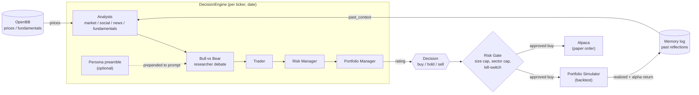
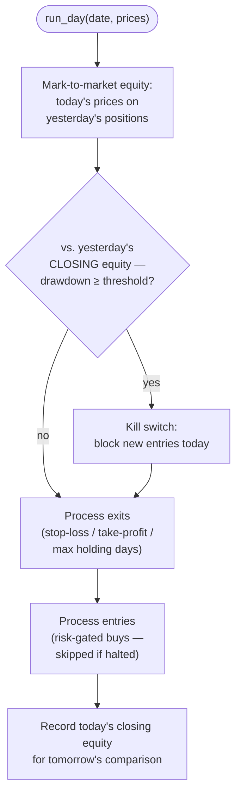
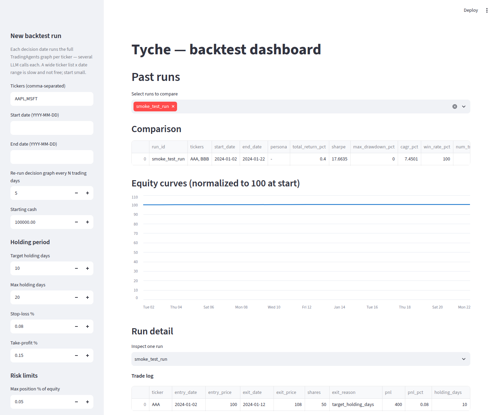

# Tyche

An AI hedge fund research project, built on existing open-source tools
rather than from scratch. Named after Τύχη, the Greek goddess of fortune
and chance — markets are exactly her domain, and no amount of multi-agent
debate changes that; see "Status" below for how much of this has actually
been tested against the real thing. Equities-first, multi-asset
architecture, tuned for a shorter holding period (swing-trade horizon:
days to a couple weeks) rather than day-trading or buy-and-hold.
Backtesting + Alpaca paper trading are wired in; no live execution.

Its decision engine is still, mechanically, a quorum: analyst, researcher,
risk-manager, and portfolio-manager agents that have to reach agreement
before a trade happens — see the diagram below.

## Status: what's actually been verified

Read this before trusting anything below. Every piece of this project has
been checked in one of two ways, and it matters which:

- **Verified for real**: code inspected against the actual installed SDKs
  (OpenBB, alpaca-py, TradingAgents) and tested against synthetic data or
  mocked LLM calls — including catching and fixing two real bugs this way
  (a kill-switch that could never trigger, a Streamlit import path issue).
  This covers essentially everything: the data wrapper, decision engine,
  portfolio simulator, risk gate, PIT validators, memory wiring, personas,
  analytics, and the dashboard's rendering.
- **Not yet run for real, anywhere**: no real market data has ever been
  pulled, no real LLM call has ever been made, and no real Alpaca order
  has ever been placed by this code. The sandbox this was built in blocks
  Yahoo Finance, SEC EDGAR, and Alpaca's API outright (403 at the network
  proxy), so none of that could be exercised here — only inspected and
  unit-tested.

**The actual next milestone is not a new feature — it's running this once,
for real**, somewhere with network access: one real `DecisionEngine.decide()`
call to see the decision quality and per-call cost, then a small real
backtest (2-3 tickers, a few months) to see a real equity curve instead of
a synthetic one. Everything past that (more personas, live execution,
wiring analytics into the risk gate) should wait until that's happened.

## Architecture

What actually happens for one (ticker, date): data flows in, a persona
(if any) gets spliced into the researcher debate, a decision comes out,
the risk gate decides whether it becomes an order, and the outcome later
feeds back into memory for the next run.



The dashed arrow is the part that needed a monkeypatch, not a config
flag — see "Personas" below for why. The directory layout behind each box:

```
tyche/
  config.py       Holding-period + risk-limit defaults (our own layer;
                   upstream has no opinion on either)
  data/
    equities.py    Thin wrapper over OpenBB's equity endpoints
  decision/
    engine.py       Wraps TradingAgentsGraph: one Decision per (ticker, date)
  backtest/
    portfolio.py    Turns Decisions into sized positions with holding-period
                    exits, a trade log and an equity curve
    validators.py   Point-in-time correctness checks for equities backtests
    runner.py       Ties data + decision + portfolio + memory into one
                    backtest run, persisted to results/runs/<run_id>/
  risk/
    gate.py         Deterministic position sizing / exposure caps / kill
                    switch — sits between a Decision and an order; never
                    bends based on the LLM's confidence or rationale
  execution/
    alpaca.py       Paper-trading execution via Alpaca; refuses anything
                    but the paper endpoint, orders always risk-gated
  dashboard/
    app.py           Streamlit UI: launch runs, compare them, read the
                     memory log's reflections
    data.py           Run-loading/scoring logic (QuantStats metrics),
                     kept Streamlit-free so it's independently testable
  personas/
    models.py         Parses an investorskills persona (invest.md/SKILL.md)
    compatibility.py   Filters personas for equities + our holding horizon
    graph.py           Wires a persona into TradingAgents' bull/bear debate
    curated.py         The initial supported persona slugs
    source.py          Pinned investorskills checkout resolution
  analytics/
    portfolio_risk.py       Concentration/correlation/tail-risk diagnostics
    correlation_regime.py   "Is the market broadly fused right now" context
```

Third-party pieces this depends on:

- **[OpenBB](https://github.com/OpenBB-finance/OpenBB)** — data layer. Unified
  API across equities/crypto/macro providers. `pip install openbb` (already
  in `pyproject.toml`).
- **[TradingAgents](https://github.com/TauricResearch/TradingAgents)**
  (Tauric Research) — the decision engine: analysts -> bull/bear researcher
  debate -> trader -> risk manager -> portfolio manager, as a LangGraph
  graph. Pulled in as a git dependency pinned to a specific commit (see
  `pyproject.toml`) since it isn't published on PyPI. Its own
  `TradingMemoryLog` + `Reflector` also give us learning-from-outcomes for
  free — see "Memory" below.
- **[Alpaca](https://alpaca.markets/) (`alpaca-py`)** — paper-trading
  execution. Chosen over building on Vibe-Trading's broker connectors: free
  paper accounts, an official maintained SDK, and a purpose-built paper
  sandbox rather than a live-money connector we'd have to run in
  paper-only mode ourselves.
- **[QuantStats](https://github.com/ranaroussi/quantstats)** — performance
  metrics (Sharpe, max drawdown, CAGR, win rate) for the dashboard, instead
  of hand-rolling them.
- **[Streamlit](https://github.com/streamlit/streamlit)** — the dashboard's
  app shell.
- **[investorskills](https://github.com/questflowai/investorskills)** —
  investor-persona data, pinned as a git submodule at
  `tyche/personas/vendor/investorskills` (see "Personas" below) rather
  than 63 files forked into this repo.
- **[Vibe-Trading](https://github.com/HKUDS/Vibe-Trading)** (HKUDS) — not
  used for execution (see the earlier decision to use Alpaca instead —
  its broker/live-trading code was still fixing margin edge cases weekly
  at the time we looked). Its non-execution analytics
  (`agent/backtest/risk_xray.py`, `regime.py`) were adapted, restyled, and
  trimmed of their broker/multi-market-loader plumbing into
  `tyche/analytics/` — see that module's docstrings for exactly what was
  kept vs. dropped, and why the larger alpha-factor zoo there was
  deliberately *not* adopted (its correctness lives in a registry harness,
  not in the individual formulas).

## Memory: agents learning from past outcomes

Not something we built — TradingAgents already ships it
(`tradingagents/agents/utils/memory.py`'s `TradingMemoryLog` +
`tradingagents/graph/reflection.py`'s `Reflector`), fully wired into its own
`propagate()`/`backtest.py`. Every decision is logged as pending; once the
holding period has passed, an LLM writes a short reflection on what the
outcome showed and what to do differently, and that lesson gets re-injected
into future prompts for the same ticker and across tickers. It's already
point-in-time safe: a backtest only sees lessons whose outcome had actually
resolved by that date.

`DecisionEngine` (in `tyche/decision/engine.py`) turns this on by default
(`memory_log_path`) and exposes `.settle(ticker)`, which `tyche/backtest/
runner.py` calls once a ticker's date grid is done — same pattern
TradingAgents' own `run_backtest` uses. Read a run's
`results/runs/<run_id>/trading_memory.md` (or the dashboard's "Agent memory
log" expander) to see the actual reflections.

## Personas: investor frameworks in the bull/bear debate

`tyche/personas/` lets an investorskills persona (e.g. Darvas Box,
Minervini VCP) argue the bull/bear researcher roles instead of
TradingAgents' generic voice — its framework text is prepended to the
actual prompt sent to the LLM, verified by capturing the constructed
prompt in tests, not just by checking a Python object got built.

**There is no supported extension point for this in TradingAgents** (read
directly from its pinned-commit source before writing this): no config
key, no subclass hook. `tyche/personas/graph.py`'s `apply_persona`
monkeypatches `tradingagents.graph.setup.create_bull_researcher`/
`create_bear_researcher` — the exact names `GraphSetup.setup_graph` calls
— for the duration of building a `TradingAgentsGraph`/`DecisionEngine`.
This is coupled to the pinned commit in `pyproject.toml`: if that pin
moves and upstream's bull/bear prompt wording changes, `graph.py`'s copy
of it needs re-diffing, or the persona silently stops reflecting whatever
changed.

Only 5 of the 63 investorskills slugs are curated by default
(`tyche/personas/curated.py`): personas are filtered for `assetClasses`
containing "public equities" and a `timeHorizon` that overlaps our ~10–20
trading-day holding window — Buffett's "5-10 years" or Cathie Wood's
"5-10 years" get excluded, not because they're bad frameworks, but because
running a multi-year buy-and-hold thesis through a system that exits in
20 days regardless produces a decision that was never designed to be
judged on that horizon. `timeHorizon` is free text across the 63 skills
("days", "days-weeks", "5-10 years", "event-driven", ...) — the parser in
`tyche/personas/compatibility.py` is an explicit heuristic over prose,
documented as such, not ground truth.

Use it via:

```python
from tyche.personas.models import load_persona
from tyche.personas.source import resolve_source_dir

persona = load_persona("darvas-box", resolve_source_dir())
engine = DecisionEngine(persona=persona)   # or RunConfig(persona_slug="darvas-box")
```

or pick one from the dashboard sidebar's "Persona" dropdown.

## Why there's a `backtest/portfolio.py` at all

TradingAgents ships its own `tradingagents/backtest.py`, but its docstring
is explicit: it scores a *rating* against realized/alpha return per
(ticker, date) cell, and is deliberately not a portfolio simulator — "must
not grow one," in its own words. That's the right scope for their project.
It means holding periods, position sizing, and P&L are a layer we have to
own, which is what `tyche/backtest/portfolio.py` and
`tyche/risk/gate.py` are.

`PortfolioSimulator.run_day` has one ordering detail that isn't obvious
from reading it top to bottom, and was in fact wrong on the first pass
(caught by testing, not by inspection): the kill-switch has to compare
today's mark-to-market equity against *yesterday's closing* equity, not
against equity computed before/after today's own exits. Comparing within
the same day meant a stop-loss exit just re-realized the same loss the
check was trying to detect — it could never actually trigger.



## Installation

**Prerequisites**: Python 3.11+, `git`, and a C compiler toolchain (some of
OpenBB's dependencies build from source on less common platforms — if
`pip install` fails on one of those, install your OS's standard build
tools and retry).

**1. Clone the repo, including the personas submodule.**

```bash
git clone --recurse-submodules https://github.com/ddkui/hedgefunding.git
cd hedgefunding
```

Already cloned without `--recurse-submodules`? Fetch it after the fact
instead of re-cloning:

```bash
git submodule update --init --recursive
```

Skipping this entirely is fine — everything except `tyche/personas`
works without it, and the dashboard's persona dropdown just disables
itself with a message pointing back at this command.

**2. Create a virtual environment and install the project.**

```bash
python3 -m venv .venv
source .venv/bin/activate        # Windows: .venv\Scripts\activate
pip install -e .
```

This pulls in OpenBB, TradingAgents (pinned to a specific commit via git,
since it isn't on PyPI), Alpaca's SDK, QuantStats, and Streamlit — expect
this to take a few minutes and pull a non-trivial amount of disk space.

**3. Configure API keys.**

```bash
cp .env.example .env
```

Then edit `.env`:

| Variable | Required? | Notes |
|---|---|---|
| `ANTHROPIC_API_KEY` | **Yes** (or another provider) | TradingAgents needs at least one LLM provider — Anthropic, OpenAI, Google, or Bedrock. Set `TRADINGAGENTS_LLM_PROVIDER` to match if you use something other than Anthropic. |
| `FMP_API_KEY`, `POLYGON_API_KEY` | No | OpenBB's `yfinance` provider needs no key for a basic equities backtest; add these later for better fundamentals/filings coverage or higher rate limits. |
| `ALPACA_API_KEY`, `ALPACA_SECRET_KEY` | No (only for paper trading) | Free at [alpaca.markets](https://alpaca.markets/) — use the **paper** account's keys, not a live account's. `ALPACA_PAPER=true` is enforced in code regardless of what you set here (see "Paper trading" below). |

**4. Verify the install.**

```bash
python3 -m pytest tests/
```

This runs entirely against synthetic data and mocked LLM calls — no API
keys or network access needed for it to pass. If it doesn't pass, nothing
past this point will work either; fix that first.

**Network policy note**: if you're running this inside a sandboxed
environment (e.g. Claude Code's web/remote environments), check its egress
policy allows the hosts OpenBB's providers, your LLM provider, and
`paper-api.alpaca.markets` need to reach — a restrictive default policy
will block these with a 403 at the proxy, not a Python error you can fix
in code. (All three were blocked in the environment this was originally
built in; the code is verified by inspection and against a real installed
SDK, but live connectivity has to be checked wherever this actually runs.)

### Running the dashboard

```bash
streamlit run tyche/dashboard/app.py
```

Configure tickers/date range/holding-period/risk parameters in the
sidebar and click **Run backtest** — each decision date calls the full
TradingAgents graph per ticker (several LLM calls each), so start with a
couple of tickers over a short date range before running anything wide.
Past runs are listed for comparison (equity curves, QuantStats metrics,
trade log, and the agent memory log's actual reflections) below.



*A real run of this dashboard against synthetic data — the comparison
table, equity curve, trade log, and persona dropdown are the actual UI,
not a mockup.*

### Paper trading (Alpaca)

`tyche/execution/alpaca.py`'s `AlpacaPaperExecutor` refuses to run
against anything but Alpaca's paper endpoint — this is a hard check in the
constructor, not a config flag you could accidentally flip. Every order
still goes through the same `RiskGate` the backtester uses. It does not
yet handle exits (closing a position per the holding-period/stop-loss/
take-profit rules against a live account) — only sizing and submitting a
buy from a fresh `Decision`. A live analogue of `PortfolioSimulator`'s
exit logic is the natural next piece, not yet built.

## Known limitations (read before trusting a backtest)

- **No portfolio-level execution yet.** `PortfolioSimulator` is a daily,
  single-fill-per-day simulator (no slippage model, no partial fills, no
  intraday price path). Fine for proving the pipeline; not enough on its
  own to size real capital.
- **Survivorship bias and estimate-vintage checks are stubbed, not solved.**
  `check_universe_survivorship` and `check_estimate_vintage` in
  `validators.py` raise `PITDataUnavailable` rather than a fake pass —
  both need point-in-time index membership / consensus-estimate history
  that free-tier data doesn't carry. Don't backtest a "current S&P 500"
  universe against history and assume it's honest.
- **Holding-day counts are calendar days, not trading days** (see the
  docstring on `PortfolioSimulator._holding_days`). Close enough at a
  10–20 day horizon; would need fixing before shortening toward
  day-trading.
- **Filing-timestamp leakage** (using a 10-Q before its actual public filing
  date, not its fiscal period end) is handled inside TradingAgents'
  `tradingagents.dataflows.sec_edgar` already — `check_filing_not_used_early`
  in our own `validators.py` is for our own pipeline code, not a re-check of
  theirs.
- **The persona monkeypatch is pinned-commit-specific.** It reimplements
  (with the persona text prepended) TradingAgents' bull/bear researcher
  prompt text as of the pinned commit. Bumping the TradingAgents pin
  without re-diffing `tyche/personas/graph.py` against the new
  `agents/researchers/{bull,bear}_researcher.py` risks the persona
  silently going stale against whatever upstream changed.
- **Persona time-horizon filtering is a heuristic, not ground truth** — see
  `tyche/personas/compatibility.py`'s own docstring. Treat every curated
  persona with human judgement at least once before trusting it in a real
  run, especially any added beyond the initial 5.
- **`tyche/analytics/` is read-only context, not a gate.** Nothing in
  `tyche/risk/gate.py` consults `portfolio_risk.py`'s concentration/
  correlation output or `correlation_regime.py`'s fused/not-fused state —
  they're diagnostics for a researcher or the dashboard to look at, not
  enforced limits. Wiring either into the risk gate itself is a real next
  step, not done here.
